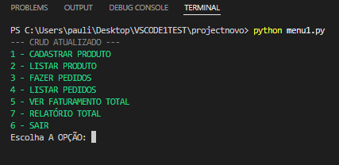
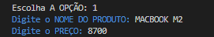
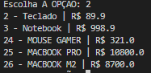
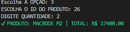
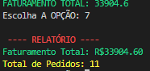

# 🧾 Sistema de Gestão de Pedidos (Python + SQLite)

Projeto desenvolvido com foco em prática de lógica de programação, banco de dados e estrutura de sistemas CRUD.

---

## 🚀 Funcionalidades

- Cadastro de produtos
- Listagem de produtos
- Criação de pedidos
- Listagem de pedidos
- Cálculo de faturamento total
- Relatório consolidado (ETL simplificado)

---

## 🛠️ Tecnologias utilizadas

- Python
- SQLite
- Colorama (interface no terminal)

---

## 🧠 Conceitos aplicados

- Estruturas de dados (listas e dicionários)
- Estruturas de controle (if, for, while)
- CRUD (Create, Read, Update, Delete)
- Integração com banco de dados
- ETL (Extract, Transform, Load)

---

## 📊 ETL aplicado

- **Extract:** dados coletados do banco SQLite
- **Transform:** cálculo de faturamento e contagem de pedidos
- **Load:** exibição no terminal

- ## 📸 Demonstração do sistema

### 🔹 Menu principal

---

### 🔹 Cadastro de produto

---

### 🔹 Listagem de produtos

---

### 🔹 Criação de pedidos

---

### 🔹 Relatório / Faturamento

---
